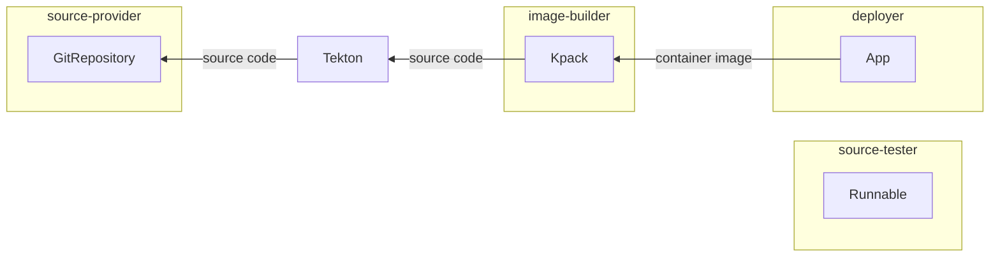

# Cartographer demo at CDF Software Supply Chain SIG

CDF Presentations URL: https://hackmd.io/l1BfXp1kQKGKSaKLbl6xJw


## Presentation

For this demonstration, I wanted to start with setting the field of what we're
building here.

First, we're going to put ourselves in the shoes of a **platform operator**

  that's the persona providing the infrastructure for all these dev teams to
  focus as much as they can solely on building and running their applications.


  ```
  platform operators

    - building the infra for dev teams to ship & run their apps

  ```


Later on, we switch to the other persona, the **app operator**

  (yes, could be anyone in the development team, but still, different persona)

  this person has access to a kubernetes environment and means of providing the
  definition of what they'd like to have continuously pushed to an environment,
  i.e., a description of the application, where the source code comes from,
  traits of the app, etc.

  this persona knows a lot about their app - how to test, resources necessary
  at runtime, etc etc, and probably knows not very much about k8s internals

  ```
  app operators

    - building the apps and preparing them for being shippable & runnable

  ```


That said, let's start building the platform.


## Platform operator

For this demo, the platform we're envisioning here is a pretty simple one -
essentially:

1. devs push code to a git repository
1. code gets tested
1. container image gets built
1. application gets deployed

> Note: usually we'd not deploy directly via the supplychain, but instead take
> a gitops approach.


Looking around at the Kubernetes landscape, we can find some pretty good
candidates for doing the job of each one of those stages:


1. devs push code to a git repository: [fluxcd's GitRepository resource][fluxcd-git-repository]
1. code gets tested: [tekton's Pipeline resource][tekton-pipeline]
1. container image gets built: [kpack's Image resource][kpack-image]
1. application gets deployed: [kapp-controller's App resource][kapp-controller-app]

To illustrate how we could use them, I'll focus on building container images
and then we expand to the choreography of them all.


### Building container images out of source code

Tools like `kpack` are great at doing the job of taking some form of source
code, and then based on that, building a container image and pushing that to a
registry, which can then be made available for deployments further down the
line.

`kpack` allows you to be very specific in terms of what to build, for instance,
by specifying which revision to use:


```yaml
apiVersion: kpack.io/v1alpha2
kind: Image
metadata:
  name: hello-world
spec:
  source:
    git:
      url: https://github.com/carto-run/hello-world
      revision: 979495ac3ce27d83d48de7d8db1cab46fa77388f
status:
  latestImage: index.docker.io/projectcartographer/hello-world@sha256:27452d42b
```

It'll under the hood, like any other Kubernetes controller, relentlessly try to
achieve the desired state expressed in the spec, then reflecting under its
status the current state - i.e., after having the image built, showing what the
absolute path to the image under `status.latestImage`.

Even better, if there's an update to the base image that should be used to
either build (for instance, `golang` bumped from 1.15 to 1.15.1 to address a
security vulnerability) or run our application (let's say, a CA certificate
should not be trusted anymore), even if there have been no changes to our
source code, `kpack` would take care of building a fresh new image for us.


```diff
  apiVersion: kpack.io/v1alpha2
  kind: Image
  metadata:
    name: hello-world
  spec:
    source:
      git:
        url: https://github.com/carto-run/hello-world
        revision: 979495ac3ce27d83d48de7d8db1cab46fa77388f    # same revision
  status:
-   latestImage: index.docker.io/projectcartographer/hello-world@sha256:27452d42b
+   latestImage: index.docker.io/projectcartographer/hello-world@sha256:142b3safc
```


But, that said, we still need to figure out a way of updating that exact field
(`spec.source.git.revision`) with the revisions we want.

i.e., it'd be great if we could somehow express:

```yaml
apiVersion: kpack.io/v1alpha2
kind: Image
metadata:
  name: hello-world
spec:
  source:
    git:
      url: https://github.com/carto-labs/hello-world
      revision: $(most_recent_commit_to_a_branch)$
  ...
```

Not only that, it would be great if we could also make this reusable so that
any developer wanting to have their code built, could _"just"_ get it done
without having to know the details of `kpack`, something like


```yaml
apiVersion: kpack.io/v1alpha2
kind: Image
metadata:
  name: $(name_of_the_project)
spec:
  source:
    git:
      url: $(developer's_repository)
      revision: $(most_recent_commit)$
```

that could get filled based on the developer's description of the application.

But before we do that, we'd first need to have a way of obtaining those commits
in the first place. This is where we'd start doing the job of chaining those
resources we talked about before together.


### Keeping track of commits to a repository

In the same declarative manner as `kpack`, there's a Kubernetes resource called
GitRepository that, once pointed at a git repository, it updates its status
with pointers to the exact version of the source code that has been discovered:

```yaml
apiVersion: source.toolkit.fluxcd.io/v1beta1
kind: GitRepository
metadata:
  name: git-repository
spec:
  interval: 1m
  url: https://github.com/carto-labs/hello-world
  ref: {branch: main}
```

which then, as it finds new revisions, updates its status letting us know where
to get that very specific revision:

```yaml
apiVersion: source.toolkit.fluxcd.io/v1beta1
kind: GitRepository
metadata:
  name: git-repository
spec:
  interval: 1m
  url: https://github.com/carto-labs/hello-world
  ref: {branch: main}
status:
  artifact:
    checksum: b2d2af59c64189efe008ba20fcbbe58b0f1532d5
    lastUpdateTime: "2021-08-11T18:20:26Z"
    path: gitrepository...2f989c4.tar.gz
    revision: main/3d42c19a61
    url: http://source-cont...89c4.tar.gz
```

But again, just like with `kpack/Image`, it would be great if we could
templatize that definition such that any development team could make use of
this, something like:

```yaml
apiVersion: source.toolkit.fluxcd.io/v1beta1
kind: GitRepository
metadata:
  name: $(name_of_the_project)
spec:
  interval: 1m
  url: $(developers_repository)$
  ref: {branch: $(branch_developers_want_to_deploy_from)$}
```


### Passing the commits discovered from GitRepository to Image

So at this point, we have two Kubernetes resources that could very well work
together:

- `fluxcd/GitRepository`, providing that source information to other resources
- `kpack/Image`, consuming source information, and then making `image`
  information available to further resources


```
kind: GitRepository
apiVersion: source.toolkit.fluxcd.io/v1beta1
spec:
  url: <git_url>
status:                                                       outputting source
  artifact:                                                      information to
    url: http://source-controller./b871db69.tar.gz ---.                  others
    revision: b871db69 -------------------------------|-----.
                                                      |     |
                                                      |     |
---                                                   |     |
kind: Image                                           |     |  outputting image
apiVersion: kpack.io/v1alpha2                         |     |    information to
spec:                                                 |     |            others
  source:                                             |     |
    git:                                              |     |
      url: <url_from_gitrepository_obj>        <------'     |
      revision: <revision_from_gitrepo_obj>    <------------'
status:
  conditions: [...]
  latestImage: gcr.io/foo/bar@sha256:b4df00d --------.
                                                     |
                                                    ...
                                                     |
                                                     ∨
                                          possibly .. a Deployment?
```

To make that possible, with Cartographer one would provide the definition of
how a GitRepository object should be managed by writing a ClusterSourceTemplate
(as it outputs "source" information)

```yaml
#
#
# `source` instantiates a GitRepository object, responsible for keeping track
# of commits made to a git repository, making them available as blobs to
# further resources in the supply chain.
#
#
apiVersion: carto.run/v1alpha1
kind: ClusterSourceTemplate
metadata:
  name: source
spec:

  # because we're implementing a `Cluster___Source___Template`, we must specify
  # how to grab information about the source code that should be promoted to
  # further resources.
  #
  # `*Path` fields expect a `jsonpath` query expression to run over the object
  # that has been templatized and submitted to Kubernetes.
  #

  urlPath: .status.artifact.url       # in the object, where to pick up the url
  revisionPath: .status.artifact.revision       # where to pick up the revision

  template:                                      # what to stamp out and submit
    apiVersion: source.toolkit.fluxcd.io/v1beta1 # to Kubernetes.
    kind: GitRepository
    metadata:
      name: $(workload.name)$            #     `$(workload.*)$` provides access
    spec:                                #        to fields from the `Workload`
      interval: 1m                       #              object submitted by the
      url: $(workload.source.git.url)$   #                           developers
      ref: $(workload.source.git.ref)$
      gitImplementation: libgit2
      ignore: ""
```

and with a `ClusterImageTemplate`, how a `kpack/Image` should be managed as it
can expose image information to other resources in the supply chain:

```yaml
#
#
# `image` instantiates a `kpack/Image` object, responsible for ensuring that
# there's a container image built and pushed to a container image registry
# whenever there's either new source code, or its image builder gets na update.
#
#
apiVersion: carto.run/v1alpha1
kind: ClusterImageTemplate
metadata:
  name: image
spec:
  imagePath: .status.latestImage    # where in the `kpack/Image` object to find
                                    #  the reference to the image that it built
                                    #  and pushed to a container image registry
  template:
    apiVersion: kpack.io/v1alpha2
    kind: Image
    metadata:
      name: $(workload.name)$
    spec:
      tag: projectcartographer/$(workload.name)$
      serviceAccount: cartographer-example-registry-creds-sa
      builder:
        kind: ClusterBuilder
        name: go-builder
      source:
        blob:
          url: $(sources[0].url)$       # source information from that a source
                                        #    provider like fluxcd/GitRepository
                                        #          from a ClusterSourceTemplate
                                        #                              provides
```

Having the templates written, the next step is to then define the link between
those two, that is, the dependency that `kpack/Image`, as described by a
ClusterImageTemplate, has on a source, `fluxcd/GitRepository`, as describe by a
ClusterSourceTemplate.

This definition of the link between the resources (and developer Workload
objects) is described by a ClusterSupplyChain:


```yaml
kind: ClusterSupplyChain
spec:
  # describe which Workloads this supply chain is applicable to
  #
  selector:
    app.tanzu.vmware.com/workload-type: web


  # declare the set of resources that form the software supply chain that
  # we are building.
  #
  resources:
    #
    - name: source-provider
      # declare that for this supply chain, a source-provider resource is
      # defined by the `ClusterSourceTemplate/source` object, making the source
      # information it exposes available to further resources in the chain.
      #
      templateRef:
        name: source
        kind: ClusterSourceTemplate

    - name: image-builder
      # declare that for this supply chain, an image-builder resource is
      # defined by the `ClusterImageTemplate/image` object, making the image
      #information it exposes available to further resources in the chain.
      #
      templateRef:
        name: image
        kind: ClusterImageTemplate
      # express that `image-builder` requires source (`{url, revision}`)
      # information from the `source-provider` resource, effectively making
      # that available to the template via `$(sources[0].)$` interpolation.
      #
      sources:
        - resource: source-provider
          name: source
```

Having gotten the definition of how each one of the objects
(fluxcd/GitRepository and kpack/Image) should be maintained, and the link
between them, all we need is for a developer to submit the intention of having
their repository built matching that supplychain:

```yaml
kind: Workload
metadata:
  labels:
    app.tanzu.vmware.com/workload-type: web
spec:
  source:
    git:
      url: https://github.com/carto-labs/hello-world
      ref: {branch: main}
```

### Continuously deploying the image built by kpack

Having wrapped `kpack/Image` as a `ClusterImageTemplate`, we can add another
resources to supply chain, one that would actually deploy that code that has
been built.

In the simplest form, we could do that with a Kubernetes Deployment object,
something like:

```yaml
apiVersion: apps/v1
kind: Deployment
metadata:
  name: my-app
spec:
  selector:
    matchLabels:
      app: my-app
  template:
    metadata:
      labels:
        app: my-app
    spec:
      containers:
        - name: main
          image: $(my-container-image)$
```

Similarly to the example before where it'd be great if `kpack/Image` got source
code information from another Kubernetes object, here it'd be great if we could
continuously pass the image that `kpack` built for us to `Deployment`, forming
that full supply chain that brings source code all the way to a deployment.


```
kind: GitRepository
apiVersion: source.toolkit.fluxcd.io/v1beta1
spec:
  url: <git_url>
status:                                                       outputting source
  artifact:                                                      information to
    url: http://source-controller./b871db69.tar.gz ---.                  others
    revision: b871db69 -------------------------------|-----.
                                                      |     |
                                                      |     |
---                                                   |     |
kind: Image                                           |     |  outputting image
apiVersion: kpack.io/v1alpha2                         |     |    information to
spec:                                                 |     |            others
  source:                                             |     |
    git:                                              |     |
      url: <url_from_gitrepository_obj>        <------'     |
      revision: <revision_from_gitrepo_obj>    <------------'
status:
  conditions: [...]
  latestImage: gcr.io/foo/bar@sha256:b4df00d --------.
                                                     |
---                                                  |
apiVersion: apps/v1                                  |
kind: Deployment                                     |
metadata:                                            |
  name: my-app                                       |
spec:                                                |
  selector:                                          |
    matchLabels:                                     |
      app: my-app                                    |
  template:                                          |
    metadata:                                        |
      labels:                                        |
        app: my-app                                  |
    spec:                                            |
      containers:                                    |
        - name: main                                 |
          image: $(my-container-image)$ <------------'
```

In order to make this happen, we'd then engage in the very same activity is
before:

- wrap the definition of `apps/Deployment` as a `ClusterTemplate` object,
- add a resource in the supplychain that make use of such `ClusterTemplate`
  taking image information as input

```
#
#
# `app-deploy` instantiates a deployment making use of a built container image.
#
#
apiVersion: carto.run/v1alpha1
kind: ClusterTemplate
metadata:
  name: app-deploy
spec:
  # definition of the object to instantiate and keep patching when
  # new changes occur.
  #
  # note that we don't specify anything like `urlPath` or `imagePath` - that's
  # because `ClusterTemplate` objects don't output any information to further
  # resources (unlike `ClusterSourceTemplate` which outputs `source`
  # information).
  #
  template:
    apiVersion: apps/v1
    kind: Deployment
    metadata:
      name: $(workload.name)$
    spec:
      selector:
        matchLabels:
          app: $(workload.name)$
      template:
        metadata:
          labels:
            app: $(workload.name)$
        spec:
          containers:
            - name: main
              image: $(images[0].image)$     # consume the image that we depend
                                             #            on from `kpack/Image`
```

Having the template created, all it takes then is to update the supplychain to
have that extra resource:

```yaml
apiVersion: carto.run/v1alpha1
kind: ClusterSupplyChain
metadata:
  name: supply-chain
spec:
  selector:
    app.tanzu.vmware.com/workload-type: web

  #
  #
  #   source-provider <--[src]-- image-builder <--[img]--  deployer
  #     GitRepository               Image                     App
  #
  #
  resources:
    - name: source-provider
      templateRef:
        kind: ClusterSourceTemplate
        name: source

    - name: image-builder
      templateRef:
        kind: ClusterImageTemplate
        name: image
      sources:
        - resource: source-provider
          name: source

    - name: deployer
      templateRef:
        kind: ClusterTemplate
        name: app-deploy
      images:
        - resource: image-builder
          name: image
```


### What next?

#### Swap out resources of the Supply Chain

As you can tell, Cartographer is not necessarily tied to any of the resources
utilized: if you want to switch [kpack] by any other image builder that does so
with a declarative interface, go for it! Indeed, the YAML in this directory replace
the `deployer` resource in the supply chain described here with a resource that
leverages [knative] and [kapp-controller].

#### Expand on the Supply Chain

The intention of this step-by-step guide was to illustrate the basic shape
of the supplychain in this repository. Next, check out the
[testing-sc] example to see how testing can be added to the
supply-chain.


[see in the live editor](https://cartographer.sh/live-editor/?pako=eJytk01vwjAMhu_9FRH3llbTJNQrp123aVdkUlMi8iUnAXW_fklboAUkpmmXyolf209eq2DFF5ITRteMA3lTUNDLYwXS7qHKDkI3NVvL4DzSR7BWdus9CJ0p9NCAhzpjTIPCmjkTiGPuTR5IZpmzyFPSoUTuDaWYMbDWFR70dyiO6gSEBTdqeTJ0kAaa3Hc2djrhthfHjwUC5VJtzhrcQZB-aMQYoTVOxM5dzTw6P147pCNSzaqyqFaroixe6teyLPvsAErYCuepmzU9BxMdH1692QYhG6Rn8jRYcNwA5yZoP5e3Jm_FVB1PG6GsRIXag4_-zwsWixuxQ06YOhAOTo-uzMy3ZI5iYGXRlNgfPL7j7uzZfJ19zeeoGhWXgfnV3_s5ye9xygTmVnZZ1HD8d8pEIXQ7wRMKWsyvC_sT3uRxz-De0ryHbD1JT9ZHNwDn7Hz-Pf2gbtBK0_0S6SFN_O2yH3MYPC8)





- we want to build a platform leveraging those primitives


2. how do we get there?


[fluxcd-git-repository]: https://github.com/fluxcd/source-controller/blob/main/docs/spec/v1beta2/gitrepositories.md
[kpack-image]: https://github.com/pivotal/kpack/blob/main/docs/image.md
[tekton-pipeline]: https://github.com/tektoncd/pipeline/blob/main/docs/pipelines.md
[kapp-controller-app]: https://carvel.dev/kapp-controller/docs/v0.36.1/app-overview/
